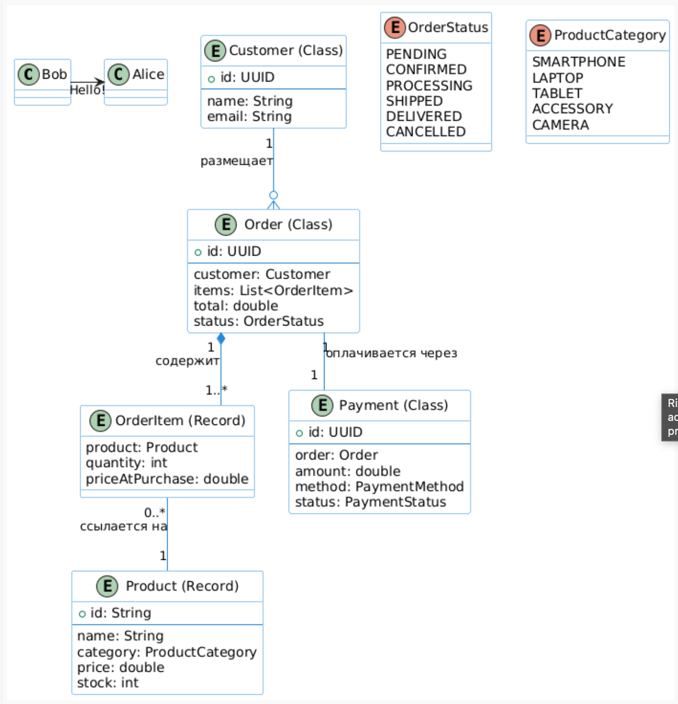
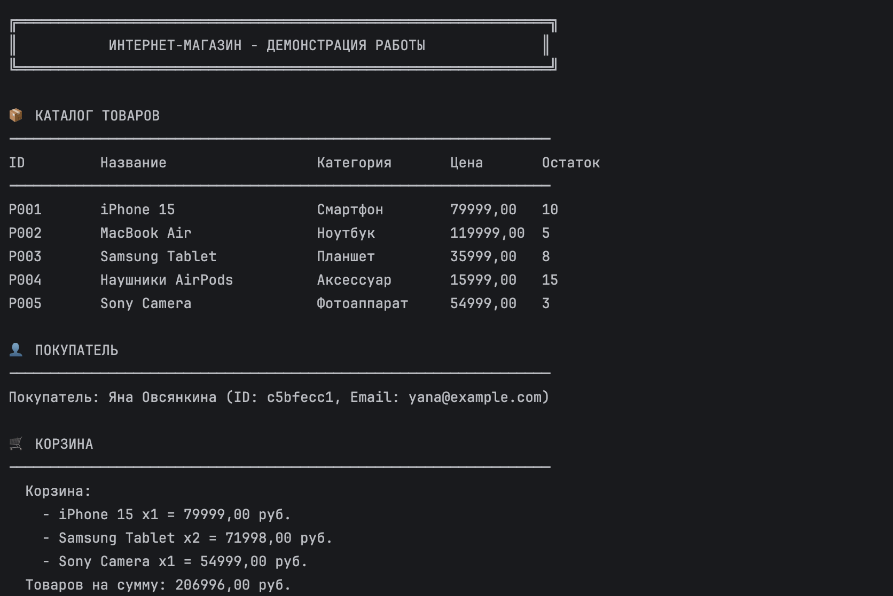
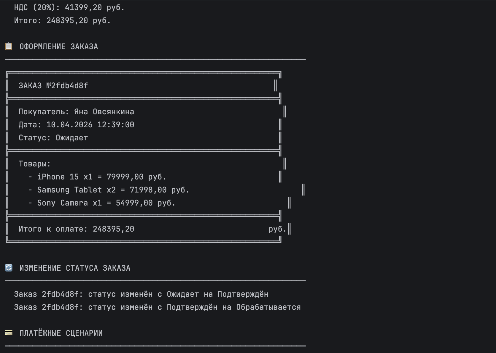
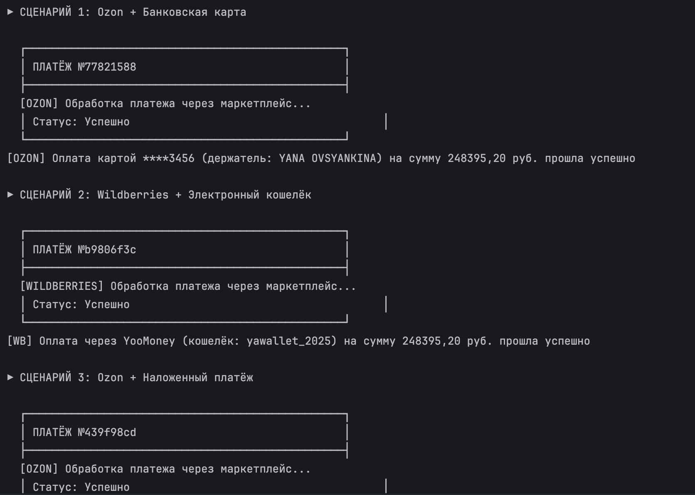
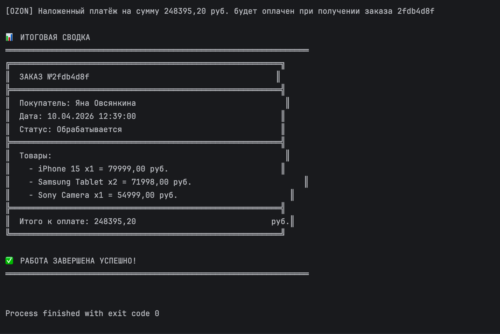

# Консольное приложение электронной коммерции 

| | |
|---|---|
| **Дисциплина** | Современные технологии программирования |
| **Срок сдачи** | 10 апреля 2026 г., 23:59  |


---
## Сведения о команде
Группа: ПИ24-3в
Команда: 040601

Студенты:
1. Овсянкина Яна Владимировна — порядковый номер в группе: 10
2. Афанасьева Ольга Александровна — порядковый номер в группе: 2
---
## Цель работы

##### Спроектировать и реализовать консольное приложение интернет-магазина на Java, демонстрирующее объектно-ориентированный подход, применение class, record, enum, interface, sealed interface, паттерна «Стратегия» для провайдеров оплаты.


## Реализованные возможности

- просмотр каталога товаров

- добавление/удаление товаров в корзину

- расчёт стоимости с НДС 20%

- оформление заказа

- отслеживание статуса заказа

- оплата через Ozon и Wildberries (карта, кошелёк, наложенный платёж)

- вывод итоговой сводки

## Ключевые технические решения
- Паттерн «Стратегия» для платежных провайдеров
- `PaymentMethod` — sealed interface с разрешёнными типами платежей
- Records для неизменяемых сущностей: `Product`, `CartItem`, `OrderItem`
- Enum для статусов заказа, категорий товаров и статусов платежей

## Запуск в IntelliJ IDEA
1. Открыть проект: `File → Open` → выбрать папку проекта
2. Найти `com.moderntech.ecommerce.main.ECommerceApp`
3. Нажать правой кнопкой мыши → `Run 'ECommerceApp.main()'`


## Запуск из терминала
```bash
javac -d out @sources.txt
java -cp out com.moderntech.ecommerce.main.ECommerceApp
```


---
## ERD



## Скриншот работы








---


## Структура пакетов (обязательно)

Корень: `com.moderntech.ecommerce`

```text
com/moderntech/ecommerce/
├── main/
│   └── ECommerceApp.java
├── models/
│   ├── Product.java              (record)
│   ├── Customer.java             (класс)
│   ├── ShoppingCart.java         (класс)
│   ├── Order.java                (класс)
│   ├── CartItem.java             (record)
│   └── OrderItem.java            (record)
├── payment/
│   ├── Payment.java
│   ├── PaymentMethod.java        (sealed interface + permits)
│   ├── CreditCardPayment.java
│   ├── DigitalWalletPayment.java
│   ├── CashOnDelivery.java
│   ├── OzonPayment.java
│   ├── WildberriesPayment.java
│   └── PaymentStatus.java        (enum)
└── enums/
    ├── OrderStatus.java
    └── ProductCategory.java
```

---
